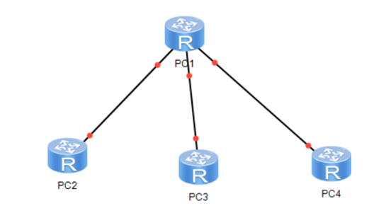

# 实验部分

## Experiment 1 : 单机串口实验

-   这是实验主要是要在本机上实现一些基础的功能 从而检测自己的器材是否正确
-   实验的基本方式是在一台设备上把发送口和接受口相连 并完成下面的实验
-   主要设计了三个实验
    -   自己发送并接收消息
    -   测试最大传输能力
    -   发送并接收一个长文本 看是否会错漏 丢失信息
-   有一个重要的检查 就是检查硬件驱动 需要手动调节波特率刷新一下 这是硬件(或者官方驱动的问题 不是我们代码的问题)

```shell
conda create -n cnetwork python=3.11
conda activate cnetwork
pip install pyserial
```

```shell
python Code/Experiment1/main.py
```

## Experiment 2 : 双机通信实验

-   本实验主要是要在双机环境下实现C/S模式的通信 验证串口连接的可靠性
-   需要将两台设备通过串口交叉相连（TX接RX RX接TX）
-   实验包含两个独立程序 需要分别运行
    -   Server端：持续监听端口 解析请求并返回数据
    -   Client端：用户交互界面 发送指令并显示回显
-   请务必先启动Server端 再启动Client端 并在启动时选择正确的COM口

```shell
# Server Side
python Code/Experiment2/server.py
```

```shell
# Client Side
python Code/Experiment2/client.py
```

## 实验三：简单拓扑的多机通信实验（链路层）
#### （一）实验目标
1. 理解链路层的帧传输原理；
2. 掌握树形拓扑的硬件连接方法；
3. 实现多机（4台）间任意两台的直接数据交付。

#### （二）实验器材
| 器材名称 | 数量 | 备注 |
|----------|------|------|
| Windows系统计算机 | 4台 | 分别命名为PC1~PC4，4人组队，每人1台 |
| USB转串口接口卡 | 12块 | 每台电脑3块（用于连接其他设备） |
| RS-232通信线 | 若干 | 按树形拓扑需求配置（确保相邻设备交叉连接） |

#### （三）实验软件
同实验一。

#### （四）实验步骤
1. **硬件连接**：
   - 
   - 按树形拓扑连接4台PC：选择1台PC作为根节点（如PC1），其余3台作为叶子节点（PC2~PC4)；
   - 根节点PC1通过3块接口卡分别连接PC2~PC4（每块接口卡对应1台叶子节点），连接方式为交叉连接（PC1_TX→PC2_RX，PC2_TX→PC1_RX，以此类推）；
   - 所有设备安装接口卡驱动，查询各自用于连接的COM口编号（如PC1连接PC2用COM4，连接PC3用COM5，连接PC4用COM6）。
   
2. **软件调试**：
   - 每台PC打开串口调试助手，配置所有已连接的COM口参数（波特率9600等）；
   - 测试相邻设备通信：PC1向PC2发送数据，验证PC2接收；PC3向PC1发送数据，验证PC1接收（确保所有链路连接正常）。
   - PC2向PC3发送数据 会经过PC1 , PC1发现是PC3在对应端口之后转发
   
3. **程序编写**：
   - 基于实验二的双机通信代码，扩展多串口管理功能（每台PC需支持同时管理多个COM口）；
   - 核心功能：任意两台PC间可直接发送数据（如PC2向PC3发送数据，需通过根节点PC1转发，链路层自动处理帧转发逻辑）；
   - 设备标识：为每台PC分配唯一标识（如ID001~ID004），数据帧中需包含源ID、目标ID；
   - 转发逻辑：根节点接收数据帧后，根据目标ID转发至对应叶子节点；叶子节点仅接收目标ID为自身的数据帧。

4. **拓展任务**：
   - 自动发现可达设备：通过洪泛法（每台设备定期广播自身ID和连接状态），实现无需人工干预的可达设备列表更新；
   - 故障容错：当某台叶子节点（如PC2）断开连接时，确保其他设备（PC3~PC4）间的通信不受影响；当根节点断开时，需提示网络中断（树形拓扑无备用路径）。

## 实验四：跨链路的多机通信实验（网络层）
#### （一）实验目标
1. 理解网络层的路由选择原理；
2. 掌握多链路拓扑的构建方法（含2跳以上路径）；
3. 实现动态/静态路由，支持设备的动态接入/退出。

#### （二）实验器材
| 器材名称 | 数量 | 备注 |
|----------|------|------|
| Windows系统计算机 | 6台 | 分别命名为PC1~PC6，6人组队，每人1台 |
| USB转串口接口卡 | 18块 | 每台电脑3块（用于连接其他设备） |
| RS-232通信线 | 若干 | 按多链路拓扑需求配置（交叉连接） |

#### （三）实验软件
同实验一。

#### （四）实验步骤
1. **硬件连接**：
   - 构建多链路拓扑：要求任意两台PC间存在至少两条可达路径，且包含2跳以上链路（如PC1→PC2→PC3→PC6，PC1→PC4→PC5→PC6）；
   - 示例拓扑：PC1连接PC2、PC4；PC2连接PC1、PC3；PC3连接PC2、PC6；PC4连接PC1、PC5；PC5连接PC4、PC6；PC6连接PC3、PC5（每台设备通过接口卡实现交叉连接）；
   - 所有设备查询并记录自身用于连接的COM口编号及对应连接的设备ID。
2. **软件调试**：
   - 每台PC打开串口调试助手，配置所有连接用COM口参数；
   - 测试直接连接设备的通信（如PC1与PC2、PC1与PC4），确保链路正常；
   - 测试跨链路通信（如PC1向PC6发送数据），通过调试助手观察数据转发过程（验证路径可达）。
3. **程序编写**：
   - 基于实验三的多串口管理功能，加入路由算法；
   - 设备标识：每台PC分配唯一ID（如ID001~ID006），并维护路由表（记录目标ID、下一跳设备ID、链路状态）；
   - 路由实现：支持静态路由（手动配置路由表）或动态路由（通过洪泛法交互链路状态，自动更新路由表）；
   - 动态适配：当某台设备接入/退出网络时，路由表自动更新，确保剩余设备间通信正常（通过心跳机制检测设备状态）；
   - 核心要求：任意两台PC间可通过最优路径（如跳数最少）实现数据交付。
4. **拓展任务**：
   - 多应用通信支持：为每台PC的不同应用分配唯一端口号（如应用1用端口8080，应用2用端口8081），数据帧中加入端口字段，实现同一设备上不同应用的独立通信。

## 实验五：多机可靠传输实验（运输层）
#### （一）实验目标
1. 理解运输层可靠传输的核心原理（停等协议、重传机制）；
2. 掌握数据校验、超时重传、确认机制的实现方法；
3. 实现多机间的无差错数据传输（支持模拟出错/超时场景）。

#### （二）实验器材
同实验四。

#### （三）实验软件
同实验一。

#### （四）实验步骤
1. **硬件连接**：
   - 沿用实验四的多链路拓扑（确保含2跳以上路径）；
   - 确认所有设备的COM口连接正常，链路通信稳定。
2. **软件调试**：
   - 使用串口调试助手模拟数据出错场景（手动修改发送数据），验证基础通信链路的容错性（未实现可靠传输时会出现数据错误）；
   - 模拟超时场景（断开某条链路后快速恢复），观察数据传输是否中断。
3. **程序编写**：
   - 基于实验四的路由功能，加入可靠传输机制（基于停等协议）；
   - 数据帧格式定义：帧头（源ID、目标ID、源端口、目标端口、帧序号、校验码、帧类型（数据/确认））+ 数据载荷；
   - 核心机制：
     - 数据校验：使用CRC32或奇偶校验计算校验码，接收端验证，校验失败则丢弃并请求重传；
     - 停等协议：发送端发送一帧后，等待接收端的确认帧（ACK），收到ACK后再发送下一帧；
     - 超时重传：发送端设置超时时间（如3秒），未在超时内收到ACK则自动重传该帧；
     - 确认机制：接收端正确接收数据帧后，立即发送对应序号的ACK帧；若接收重复帧，丢弃数据但重新发送ACK；
   - 模拟测试：手动触发数据出错（修改校验码）、超时（延迟发送ACK），验证程序是否能正确重传并接收正确数据。
4. **拓展任务**：
   - 滑动窗口协议实现：将停等协议扩展为滑动窗口（如窗口大小为3），支持连续发送多个帧后再等待ACK，提升传输效率；
   - 窗口大小优化：测试不同窗口大小（1~5）下的传输速率，确定最优窗口大小。

## 实验六：简单网络管理实验（应用层）
#### （一）实验目标
1. 理解ping和traceroute工具的核心原理；
2. 掌握应用层网络管理功能的实现方法；
3. 实现多机网络的可达性检测与路径追踪。

#### （二）实验器材
同实验四。

#### （三）实验软件
同实验一。

#### （四）实验步骤
1. **硬件连接**：
   - 沿用实验四的多链路拓扑；
   - 确保所有设备的路由功能正常（基于实验四实现）。
2. **软件调试**：
   - 使用Windows系统自带的ping命令（如ping 目标IP，实验中替换为设备ID）测试设备可达性；
   - 使用tracert命令（如tracert 目标IP）测试路径追踪，记录实际路径（跳数、设备ID）。
3. **程序编写**：
   - 基于实验四的路由功能和实验五的可靠传输机制，实现ping和traceroute功能；
   - ping功能实现：
     - 客户端（发起ping的设备）向目标设备发送ICMP回声请求帧（含请求标识、序列号、发送时间戳）；
     - 目标设备收到后，立即返回ICMP回声响应帧（携带相同标识和序列号、接收时间戳）；
     - 客户端计算往返时间（RTT=接收时间戳-发送时间戳），并统计丢包率（未收到响应的请求数/总请求数）；
     - 输出要求：显示目标设备是否可达、RTT平均值、丢包率。
   - traceroute功能实现：
     - 客户端向目标设备发送含TTL（生存时间）的测试帧，TTL初始值为1；
     - 每一跳设备收到帧后，TTL减1，若TTL=0则返回ICMP超时帧（包含自身ID）；
     - 客户端收到超时帧后，记录该跳设备ID，将TTL加1后继续发送测试帧；
     - 当测试帧到达目标设备时，目标设备返回ICMP响应帧，客户端停止测试并输出完整路径（所有跳数的设备ID）；
     - 输出要求：按跳数顺序显示路径中的设备ID、每跳的RTT。
4. **拓展任务**：
   - 批量ping测试：实现同时向多个目标设备发送ping请求，批量输出可达性结果；
   - traceroute路径优化：结合实验四的路由算法，显示最优路径与备选路径的追踪结果。